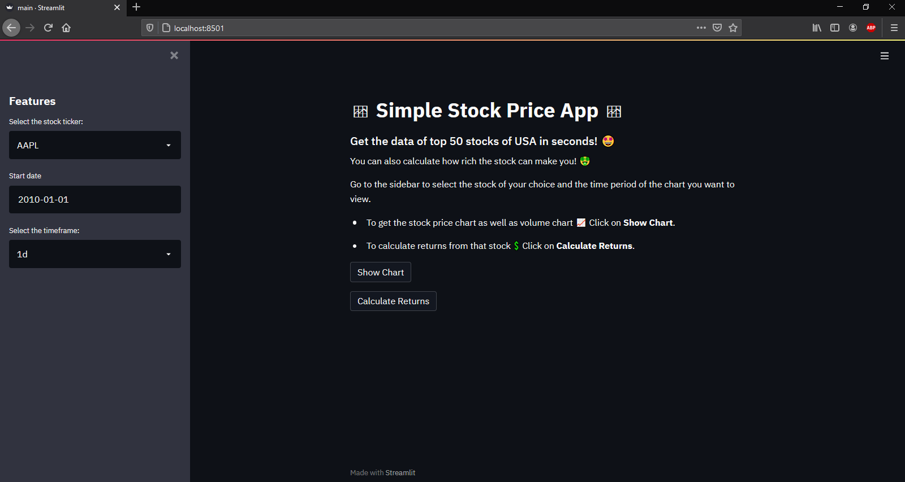

# Stock Price App
> A Stock Price charting and returns calculator app. 

## Table of Contents
* [General Information and Features](#general-information-and-features)
* [Technologies Used](#technologies-used)
* [Screenshots](#screenshots)
* [Setup](#setup)
* [Usage](#usage)
* [Project Status](#project-status)
* [Room for Improvement](#room-for-improvement)
* [Acknowledgements](#acknowledgements)

## General Information and Features
- Can select one of the top 50 stocks in the USA. (BRK.A stock price chart is not functional)
- Can show a line graph for the closing price of the stock of upto the past 50 years till now or from the date you want to current time.
- Can display a bar chart of the volume of the stock 
- Can calculate your returns if you would had invested in that stock on a previous date.

## Technologies Used
- Python, version 3.9.1
- Streamlit, version 0.81.1

## Screenshots

## Setup
The following python libraries are needed for this project:
-streamlit : To install and learn more about streamlit click [here](https://docs.streamlit.io/en/stable/installation.html).
-pandas : To install and learn more about pandas click [here](https://pandas.pydata.org/pandas-docs/stable/getting_started/install.html).
-yfinance : To install and learn more about Yahoo Finance click [here](https://python-yahoofinance.readthedocs.io/en/latest/api.html).

## Usage
Make sure all the above mentioned libraries are installed. After that, go to the project directory and type the below command to run the code.

`streamlit run main.py`

The app will open in your default browser. 

## Project Status
Project is: Above mentioned features are all working, but I am looking to add more features in this. So I would say the project is still **In Progress.**

## Room for Improvement
Include areas you believe need improvement / could be improved. Also add TODOs for future development.

Room for improvement:
- UI can be improved.
- Charts can be loaded faster.

To do:
- Add option to select any exchange in the world and select any stock from it.
- Using Web Scraping instead of manual list input.
- Displaying candlestick charts instead of line charts.
- Watchlist of stocks.
- Advanced: Evolve this app into a brokerage app that with login authentication and a database to store transaction records and funds in the account.

## Acknowledgements
Give credit here.
- This project was inspired by The Data Professor and Free Code Camp. Check out their Youtube Channels: [The Data Professor](https://www.youtube.com/c/DataProfessor) [FreeCodeCamp](https://www.youtube.com/channel/UC8butISFwT-Wl7EV0hUK0BQ)
- This project was based on [this tutorial](https://youtu.be/JwSS70SZdyM).
- Many thanks to FreeCodeCamp and The Data Professor!

If you have any suggestions do let me know. Thanks for checking out my project!
